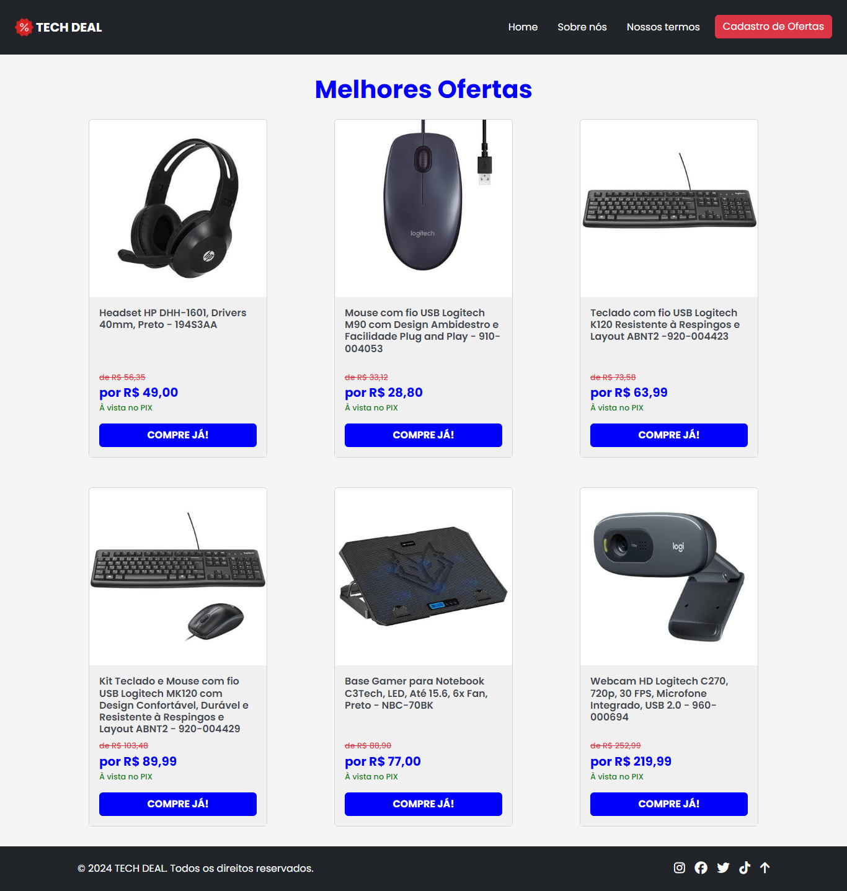

# Santander Coders 2024 | Módulo 1 - Front-End Estático | Projeto Final: Catálogo

- Projeto final individual realizado com os conhecimentos obtidos ao longo do módulo de Front-End Estático durante a formação Desenvolvimento Front-end do Santander Coders 2024.

## Professor
- [Luís Fernando Teixeira Bicalho](https://www.linkedin.com/in/lu%C3%ADs-fernando-teixeira-bicalho-a4b210158/)

# Descrição do projeto

Desenvolver, utilizando os conceitos abordados ao longo do módulo, um catálogo/cardápio digital.

## Requisitos

- Fazer um cardápio/catálogo digital;
- Todo produto deste cardápio/catálogo deve possuir uma imagem, um nome e um preço;
- É necessário ter um header com navegação para outras páginas HTML (Sobre e Cadastro), que deverá colapsar a partir de uma certa largura;
- A página de sobre deve ter uma imagem grande e uma descrição;
- A página de cadastro deve ter um formulário para cadastrar um item no catálogo;
- A página deve ser otimizada para SEO e acessibilidade;
- A página deve ser feita usando Bootstrap ou qualquer outra biblioteca CSS;
- A página deve ser responsiva;

## Tecnologias utilizadas

- HTML Semântico
- CSS
- Bootstrap

# Resultado final

[Link do Deploy](https://fgarrido-dev.github.io/Projeto-Catalogo/)
